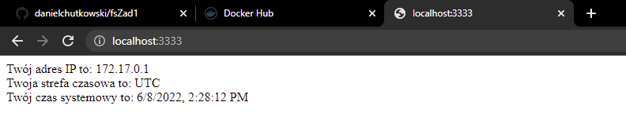

#LABORATORIUM:
##PROGRAMOWANIE FULL-STACK W CHMURACH OBLICZENIOWYCH
##Zadanie 1
###1. 
Proszę napisać program serwera (dowolny język programowania), który realizować będzie
następującą funkcjonalność:
a. po uruchomieniu kontenera, serwer pozostawia w logach informację o dacie
uruchomienia, imieniu i nazwisku autora serwera (imię i nazwisko studenta) oraz porcie
TCP, na którym serwer nasłuchuje na zgłoszenia klienta.
b. na podstawie adresu IP klienta łączącego się z serwerem, w przeglądarce powinna zostać
wyświetlona strona informująca o adresie IP klienta i na podstawie tego adresu IP, o dacie
i godzinie w jego strefie czasowej. 
#
Rozwiązanie punktu znajduje się w pliku server.js zlokalizowanym w folderze server  
#
###2.
Opracować plik Dockerfile, który pozwoli na zbudowanie obrazu kontenera realizującego
funkcjonalność opisaną w punkcie 1. Przy ocenie brane będzie sposób opracowania tego pliku
(dobór obrazu bazowego, wieloetapowe budowanie obrazu, ewentualne wykorzystanie warstwy
scratch, optymalizacja pod kątem funkcjonowania cache-a w procesie budowania). Dockerfile
powinien również zawierać informację o autorze tego pliku (ponownie imię i nazwisko studenta).
#
Plik Dockerfile znajduje się w folderze server
#
###3. 
Należy podać polecenia niezbędne do:

(polecenia należy wykonać będąc w filerze server)
####a. 
zbudowania opracowanego obrazu kontenera,

`docker build . -t daniel6657/zad1`
####b. 
uruchomienia kontenera na podstawie zbudowanego obrazu,

`docker run -p 3333:3333 -d --name node_server daniel6657/zad1`

####c. 
sposobu uzyskania informacji, które wygenerował serwer w trakcie uruchamiana kontenera
(patrz: punkt 1a),

Po wykonaniu polecenia z podpunktu `b.` zostanie wyświetlone ID kontenera.
(w tym przypadku `311c7646aff41c7e1c409d0f515433d089a51a1d40a9dcc5cc19fe3959e0bbf3`)

Możemy na jego podstawie wykonać polecenie `docker logs 311c7646aff41c7e1c409d0f515433d089a51a1d40a9dcc5cc19fe3959e0bbf3`
W wyniku którego zostaną wyświetlone logi ze skryptu server.js
```
Kontener uruchomiony w dniu 6/8/2022, 1:59:57 PM
Autorem serwera jest Daniel Chutkowski
Serwer nasłuchuje na porcie 3333`
 ```
Po uruchomieniu adresu `localhost:3333` w przeglądarce zobaczymy informacje które chcieliśmy wyświetlić.


####d. 
sprawdzenia, ile warstw posiada zbudowany obraz

`docker history daniel6657/zad1`

```aidl
IMAGE          CREATED         CREATED BY                                      SIZE      COMMENT
788242f56ee4   3 minutes ago   LABEL org.opencontainers.image.authors=damia…   0B        buildkit.dockerfile.v0
<missing>      3 minutes ago   CMD ["node" "server.js"]                        0B        buildkit.dockerfile.v0
<missing>      3 minutes ago   EXPOSE map[3333/tcp:{}]                         0B        buildkit.dockerfile.v0
<missing>      3 minutes ago   COPY . . # buildkit                             2.67MB    buildkit.dockerfile.v0
<missing>      20 hours ago    RUN /bin/sh -c npm install # buildkit           2.7MB     buildkit.dockerfile.v0
<missing>      20 hours ago    COPY package*.json ./ # buildkit                44.4kB    buildkit.dockerfile.v0
<missing>      20 hours ago    RUN /bin/sh -c apk add --update nodejs npm #…   50.9MB    buildkit.dockerfile.v0
<missing>      20 hours ago    WORKDIR /usr/src/app                            0B        buildkit.dockerfile.v0
<missing>      23 hours ago    ADD alpine-minirootfs-3.15.4-aarch64.tar.gz …   5.32MB    buildkit.dockerfile.v0
```
###4.
Zbudować obrazy kontenera z aplikacją opracowaną w punkcie nr 1, które będą pracował na
architekturach: linux/arm/v7, linux/arm64/v8 oraz linux/amd64. Obrazy te należy przesłać do
swojego repozytorium na DockerHub.

`docker buildx build -t daniel6657/zad1 --platform linux/arm/v7,linux/arm64/v8,linux/amd64 --push .`

Link do repozytorium: `https://hub.docker.com/repository/docker/daniel6657/zad1`